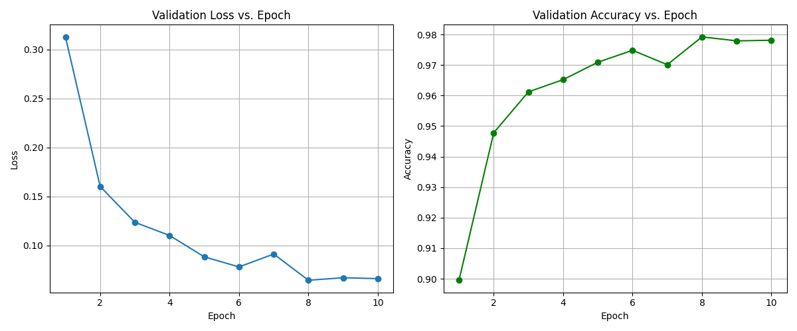
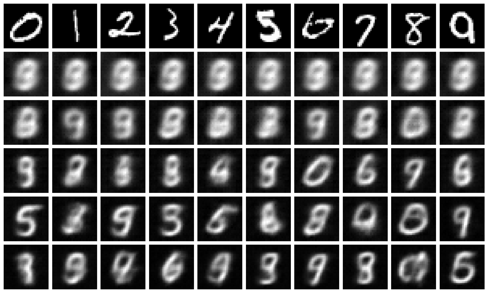

<h2>Supervised Classification</h2>

<h2>VAE</h2>
<h3>Amortized</h3>

The total loss and MSE decrease significantly in the first 10 epochs and then plateau, 
indicating successful training.

The KL divergence increases steadily and plateaus, as wanted with better latent 
regularization.
 

The gap between training and validation loss is small, pointing to no harsh overfitting.
 

<h4>Training:</h4>

<h4>Validation:</h4>

Epoch 1: Reconstructions are blurry, barely resembling digits.

Epoch 5-10: Shapes become sharper, and digit identity is typically
preserved. Epoch 20-30: Reconstructions continue to get better, with
strong fidelity to input.

The small discrepancy in MSE and visually similar quality of
reconstruction for training and validation samples shows that the model
did not overfit the training data significantly.

We can also see that in both of the given 10 digits the model gets 1
wrong and at different values

<h4>Sampling:</h4>

<h3>Latent Optimization</h3>
<h4>Training:</h4>

<h4>Validation:</h4>

The latent optimization VAE produces reconstructions that often fail to 
preserve the digit's class. The digits are frequently distorted and 
unrecognizable. This indicates that it can lead to representations that sacrifice 
semantic meaning and class information.

So we can conclude that the amortized VAE produces better *q* vectors
mainly in terms of preserving the class identity of the digits.

<h4>Sampling:</h4>

The samples from the latent optimization VAE are poor but appear like
recognizable digits. They appear like blurry digits resembling some time
to more than one, in compression the samples from the amortized VAE are
recognizable digits resembling only one digit, with some light
blurriness.

The initialization was sufficient, we can see that in some cases we
start the same and have the same latent vectors. We in both cases get
reasonable latent vectors and in the amortized we even get good
predictions.

<h3>Computing the log-probability of an image</h3>
<h5>Amortized</h5>

<h5>Latent Optimization</h5>

<h4>Average log-probabilities per digit </h4>
<table>
  <tr>
    <th>Digit</th>
    <th>Amortized</th>
    <th>Latent Optimization</th>
  </tr>
  <tr>
    <td>0</td>
    <td>-217.58871459960938 </td>
    <td>-514.7296142578125</td>
  </tr>
  <tr>
    <td>1</td>
    <td>-68.08492279052734</td>
    <td>-137.36550903320312</td>
  </tr>
  <tr>
    <td>2</td>
    <td>-295.7515869140625</td>
    <td>-484.9649963378906</td>
  </tr>
  <tr>
    <td>3</td>
    <td>-238.4097900390625</td>
    <td>-428.3619079589844</td>
  </tr>
  <tr>
    <td>4</td>
    <td>-206.52548217773438</td>
    <td>-330.36676025390625</td>
  </tr>
  <tr>
    <td>5</td>
    <td>-301.0711975097656</td>
    <td>-484.19464111328125</td>
  </tr>
  <tr>
    <td>6</td>
    <td>-231.7938690185547</td>
    <td>-463.27215576171875</td>
  </tr>
  <tr>
    <td>7</td>
    <td>-144.23634338378906</td>
    <td>-324.5142517089844</td>
  </tr>
  <tr>
    <td>8</td>
    <td>-295.1378479003906</td>
    <td>-478.99755859375 </td>
  </tr>
  <tr>
    <td>9</td>
    <td>-161.9153289794922</td>
    <td>-375.8153991699219</td>
  </tr>
</table>

 Digit 1 has the highest (least negative) log-probability in both cases.Digit 1 
has a very consistent and simple structure (a vertical line), which the VAE can 
model well, leading to higher log-probability.More complex digits (like 2, 5, 8) 
show greater variability and are harder to model, resulting in lower 
log-probabilities.

<h4>Average log-probabilities</h4>
<h5>Train</h5>

Amortized: -208.86781311035156

Latent Optimization: -208.86781311035156

Training images are more likely. This is 
expected: the model has directly learned 
from them, so it reconstructs them better 
and assigns higher log-probability.

<h5>Test</h5>

Amortized: -414.5937194824219

Unexpectedly, test images are more likely. 
This may indicate overfitting or instability in 
the latent optimization approach. This 
mismatch suggests the model may have 
overfitted badly to the training images. 

